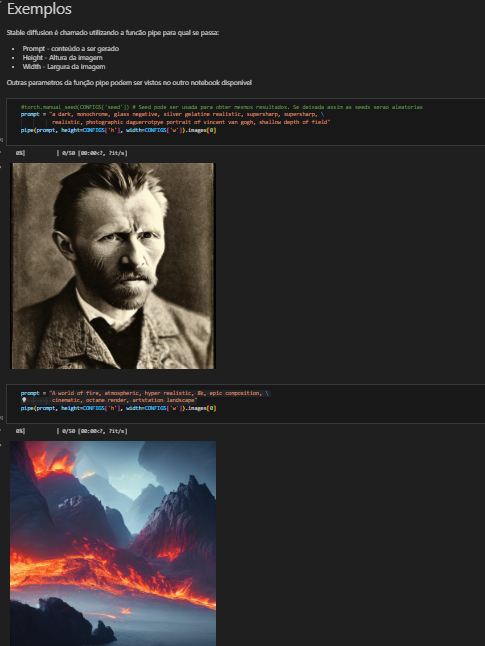
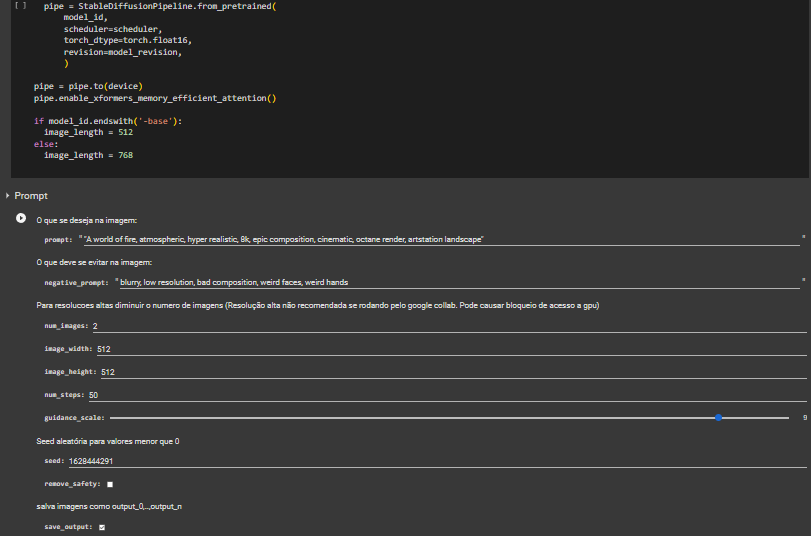
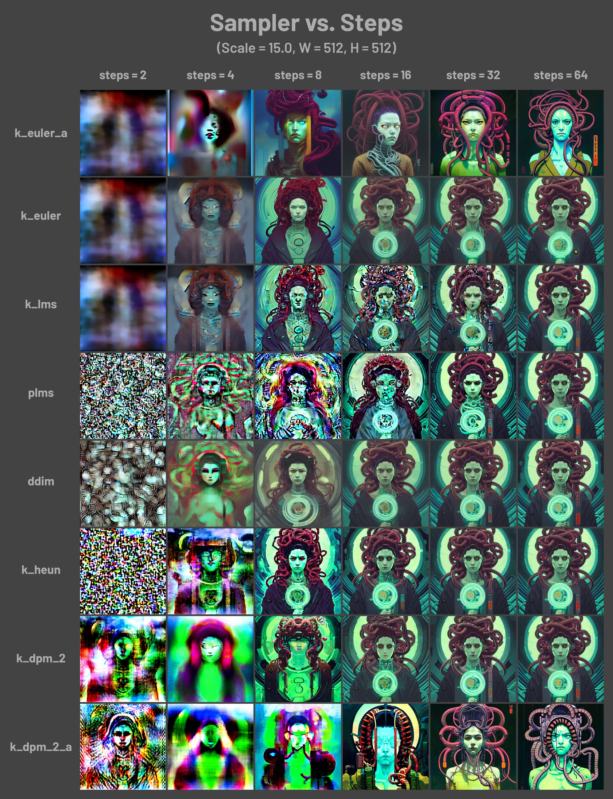
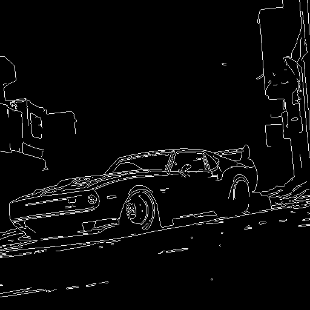
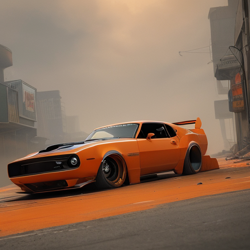

# Stable Diffusion

Email: tiagoluz.grad@gmail.com

## Links uteis

<!--  -->

## Material sobre stable diffusion

 

Este repositorio contem um notebook exemplo para rodar Stable Diffusion 1.4 em uma GPU com 6GB de VRAM e um notebook para utilizar dentro do google collab. Mais informações no [PDF](Stable_Diffusion_Info.pdf) disponibilizado.

 

Os notebooks podem ser executados sem outras dependências.

## Stable Diffusion Example

Notebook exemplificando uma implementação simples de stable diffusion

 

## Stable Diffusion Collab

Notebook para uso de txt2img no google collab

## AUTOMATIC1111 Collab

Notebook para rodar automatic 1111 pelo google collab. (Instavel sem versão paga)

# Melhorando resultados do Stable Diffusion
Esta parte está melhor explicada no pdf disponível. É recomendado sua leitura e consulta a este [artigo](https://stable-diffusion-art.com/prompt-guide/)
## Anatomia do prompt
Para prompts pode-se dividir as palavras chaves nas seguintes categorias:

    Subject - Sujeito ou objeto principal da imagem. Quanto mais detalhes melhor será o resultado.
    Medium - Material usado para produzir imagem (Photography, Digital art, Painting)
    Style - Estilo artístico da imagem
    Artist - Usa estilo de um artista como referência
    Website - Usa resultados de um website como referência
    Resolution - Palavras chaves que ajudam a melhorar a qualidade e nitidez da imagem
    Additional details - Adjetivos e características que ajudam a especificar a imagem
    Color - Ajuda a controlar a cor das imagens que pode se manifestar nos tons da imagem ou nos objetos em si
    Lighting - Iluminação é muito importante na composição de imagens e portanto pode ter grande influência no resultado final.

## Prompt negativo
No stable diffusion é possível adicionar um prompt negativo que informa o que é indesejado na imagem. Um prompt universal que pode ser utilizado é o seguinte:

    ugly, tiling, poorly drawn hands, poorly drawn feet, poorly drawn face, out of frame, extra limbs, disfigured, deformed, body out of frame, bad anatomy, watermark, signature, cut off, low contrast, underexposed, overexposed, bad art, beginner, amateur, distorted face, blurry, draft, grainy, title, text

## Peso nas palavras chaves
O peso de uma palavra no prompt pode ser ajustado com a seguinte sintaxe: (keyword:factor). Uma sintaxe alternativa é simplesmente utilizar parênteses que aumentam por uma fator de 1.1 ou colchetes que diminuem por um fator de 0.9. Esses fatores são cumulativos da seguinte forma:
<table border="1">
 <tr>
    <td>    
(keyword) = (keyword:1.1)    

((keyword)) = (keyword:1.21)

(((keyword))) = (keyword:1.33)</td>
    <td>
[keyword] = (keyword:0.9)

[[keyword]] = (keyword:0.81)

[[[keyword]]] = (keyword:0.73)
</td>
 </tr>
</table>

## Modelo utilizado
Por se tratar de uma modelo open-source, a comunidade do Stable Diffusion criou centenas de modelos personalizados. Estes possuem forte influência nos resultados obtidos por um prompt e podem ajudar muito quando se procura gerar um tipo específico de imagem (disney, anime, hq, pintura, fotografia, etc.). Dois sites que podem ser visitados para encontrar modelos são o [hugging face](https://huggingface.co/models?other=stable-diffusion) e o [civtai](https://civitai.com).
Alguns modelos populares são:

- [Stable Diffusion 2.1](https://huggingface.co/stabilityai/stable-diffusion-2-1) - Modelo base do stable diffusion
- [Dreamlike Photoreal 2.0](https://huggingface.co/dreamlike-art/dreamlike-photoreal-2.0) - Modelo para imagens fotorealistas

- [Realistic Vision 1.4](https://huggingface.co/SG161222/Realistic_Vision_V1.4) - Modelo para imagens realistas

- [Realistic Vision 2.0](https://civitai.com/models/4201/realistic-vision-v20) - Modelo para imagens realistas

- [Dreamlike Anime 1.0](https://huggingface.co/dreamlike-art/dreamlike-anime-1.0) - Modelo treinado no estilo anime

- [A-Zovya RPG Artist Tools](https://civitai.com/models/8124/a-zovya-rpg-artist-tools) - Modelo para artes de rpg

- [Openjourney](https://civitai.com/models/86/openjourney): Modelo treinado em 124 mil imagens geradas pelo midjouney

- [sd-pokemon-diffusers](https://huggingface.co/lambdalabs/sd-pokemon-diffusers) - Modelo treinado para gerar pokemons

## Sampler
Os samples determinam o ruído em cada steps da geração e portanto influenciam fortemente no resultado final.

# Outro técnicas do Stable Diffusion

# Inpainting
Uma explicação de como utilizar inpainting pode ser encontrada [aqui](https://stable-diffusion-art.com/inpainting_basics/).

# Controlnet 

A melhor opção para executar o ControlNet é pelo automatic1111. A explicação completa de como fazer isso pode ser encontrada [aqui](https://stable-diffusion-art.com/controlnet/). Os modelos otimizados do ControlNet (necessários para rodar com 4GB de VRAM) podem ser encontrados aqui. É importante ressaltar que dependendo dos modelos utilizados, podem ocorrer problemas de memória, por isso é recomendado verificar essa questão. Uma opção é utilizar o “webui-user.bat” para lowvram disponível no repositório.
